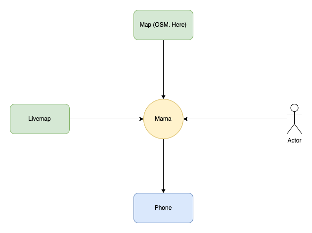
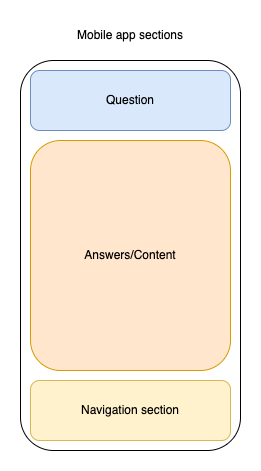
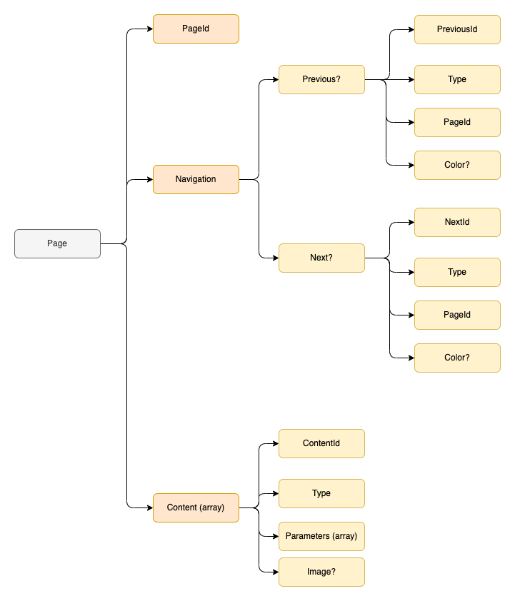

# Documentation

## Technology stack

1. 

## Context

| System/Actor | Description |
|-|-|
| Livemap | Integration with livemap system to get data points |
| Map| Offline map (Open Street map/Here maps)|
| User | App user |
| Phone | Call 112 |

## Application sections

## Data schema

| Property | Description |
|-|-|
| QuestionId | Question Id|
| Question | Question |
| Navigation | Navigation object |
| Previous | If the property is set to true, arrow to the left is displayed |
| Next | If the property is set to true, arrow to the left is displayed |
| Answer | Array of possible answers to the question |
| AnswerId | Answer Id|
| QuestionId | The Id of the question to which the user is redirected in case the answer is selected |
| Clickable |  |
| Color | Answer color code in hex format |
| Image | Image name which should be displayed |
| Content (array) |  |
| ContentId | ContentId |
| Type | Content type. Possible values TEXT, TIMER |
| Text | Content text |
| Clickable | Set to true if content is clickable |
| Parameters | Array of content parameters |
